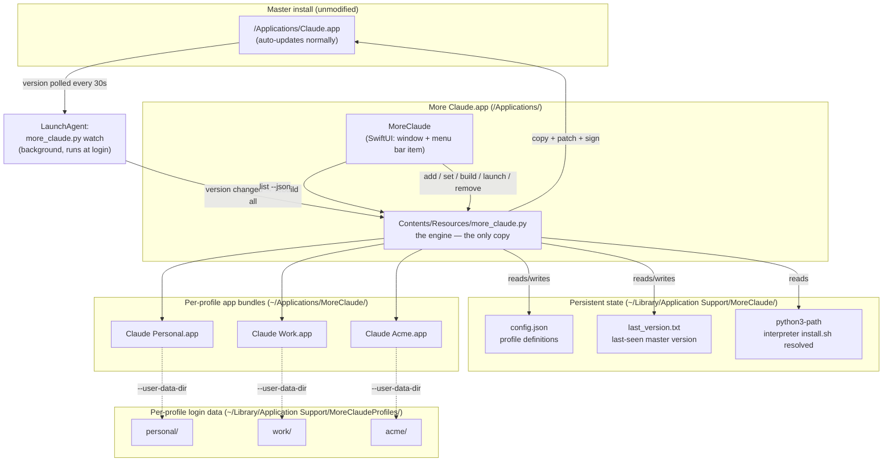

# Architecture — More Claude

This document describes how the pieces fit together, why they're built the
way they are, and where the natural extension points are. Read this before
modifying `more_claude.py`, the menu bar app, or the watcher.

## Goals that shaped the design

1. Run N Claude Desktop accounts simultaneously on one Mac.
2. Never lose a login when the real Claude Desktop app updates.
3. No macOS user-profile switching, no manual re-patching after updates.
4. Each account visually distinct (own Dock icon/name).
5. Extensible to arbitrary numbers of accounts, not hardcoded to 2.

Everything below follows from goal #2 in particular — that's the constraint
that rules out simpler approaches (see "Rejected approaches" at the end).

## Component map



Two processes exist at runtime (three when a profile is open):

| Process | Runs | Purpose |
|---|---|---|
| `More Claude.app` | While you have it open (or in the menu bar) | Window + menu bar UI over the engine |
| `more_claude.py` (engine) | On demand, invoked by the app or by you | Add/remove/build/launch profiles |
| `more_claude.py watch` | Continuously, via LaunchAgent | Detects master app updates, triggers rebuilds |

They never talk to each other directly — they coordinate only through two
files on disk: `config.json` (profile definitions) and the profile app
bundles/data directories themselves. This is deliberate: no IPC, no daemon
socket, nothing to get out of sync beyond "did the file get written."

## The core trick: bundle vs. data directory

This is the single most important design decision, and everything else
serves it.

- **The `.app` bundle** (`~/Applications/MoreClaude/<Name>.app`) is
  treated as **disposable, derived output**. It's rebuilt from the master
  app on every update. Nothing of value is allowed to live inside it.
- **The data directory**
  (`~/Library/Application Support/MoreClaudeProfiles/<id>/`) is the **only
  persistent state that matters** — login tokens, chat history, local
  settings. It is never deleted by a rebuild, only by explicit
  `remove --purge`.

The link between the two is a single `--user-data-dir=<data dir>` flag,
injected by wrapping the app's executable (see below). Because Electron
respects `--user-data-dir` at the Chromium level regardless of the app's
internal name/identifier logic, this isolation doesn't depend on guessing
how Claude Desktop derives its storage path internally — it's an explicit
override.

**Rule for future changes:** if you're tempted to write something into the
`.app` bundle that needs to survive a rebuild, it belongs in the data
directory (or in `config.json`) instead.

## `build_profile()` step by step

This is the function to understand before changing anything (in
`more_claude.py`):

1. **Copy** the master app into a *staging* directory beside the
   destination — `.moreclaude-staging-<Name>.app-<pid>` — using `cp -Rc`
   (APFS clonefile, instant + space-efficient) with a fallback to `cp -R`.

   Steps 1–5 never touch the installed bundle. Copying and re-signing a
   multi-gigabyte Electron app takes minutes; building in place would leave
   the profile unlaunchable for that entire window, and permanently broken if
   the build were interrupted. Staging means a failed rebuild leaves the
   previous working profile exactly as it was.
2. **Patch `Info.plist`**: `CFBundleIdentifier` and `CFBundleDisplayName`
   are rewritten so macOS treats this as a genuinely different app (own Dock
   icon, own Login Items entry, own Launch Services record) rather than a
   second window of the same app.

   **`CFBundleName` is deliberately left alone.** Electron builds the path to
   its helper processes out of it — `Contents/Frameworks/<CFBundleName>
   Helper.app` — so renaming it makes the app die at startup with
   `FATAL: Unable to find helper app`. The distinct Dock entry comes from the
   bundle identifier and the `.app` filename regardless.
3. **Install a custom icon** (optional): converts png/jpg to `.icns` via
   `sips` + `iconutil` if needed, drops it in `Contents/Resources/`, points
   `CFBundleIconFile` at it.
4. **Add a launcher**: a small shell script is written to
   `Contents/MacOS/<Claude>-profile` and `CFBundleExecutable` is pointed at
   it. It execs the real binary with `--user-data-dir=<profile's data dir>`
   appended, which is what pins the profile to its own login data.

   The real binary keeps its original name and location, for the same reason
   `CFBundleName` does: Electron also resolves helpers relative to the
   running executable. An earlier version renamed it to `Claude-bin` and hit
   exactly that failure.
5. **Strip quarantine + re-sign**: `xattr -cr` removes any quarantine flag
   inherited from the copy, then the bundle is re-signed ad-hoc, inside-out
   — nested code first, the outer bundle last. `--deep` is deprecated and
   applies one set of entitlements to every nested binary, so each item is
   signed individually with entitlements read from *its own counterpart in
   the untouched master* (our copy's signature is no longer readable by
   then).

   Those entitlements are rewritten for an ad-hoc identity, which is
   load-bearing in two ways:
   - **Team-bound entitlements are dropped** (`application-identifier`,
     `team-identifier`, `keychain-access-groups`, `associated-domains`).
     They name a specific Apple Developer team; an ad-hoc signature has none,
     and keeping them yields a binary macOS refuses to launch.
   - **`com.apple.security.cs.disable-library-validation` is added.** The
     hardened-runtime flag is preserved, and library validation would
     otherwise require every loaded library to share a team identity we
     don't have.

   `requirements` is never preserved: the designated requirement names the
   original signing certificate (`certificate leaf[subject.OU] = <team>`),
   which an ad-hoc signature can never satisfy, and preserving it makes
   every nested item verify as "modified or invalid".

   Note that the launcher is a shell script, so it cannot itself carry
   entitlements — but it `exec`s into the real binary, and after `exec` the
   process runs under *that* image's signature and entitlements.
6. **Swap into place**, atomically. The "is it running?" check is repeated
   first, since the build took minutes and the user may have opened the
   profile meanwhile. Then `os.rename` moves the old bundle aside and a
   second `os.rename` moves staging into place — both instant, both on the
   same filesystem, so the destination is never a partially-written
   directory. The displaced copy is deleted afterwards, once the new profile
   is already live. Leftovers from an interrupted run are swept at the start
   of the next build.
7. **Re-register with Launch Services** (`lsregister -f`) so Finder,
   Spotlight, and the Dock immediately recognize it as a distinct app
   instead of caching the old identity.

Rebuilding is idempotent: it always redoes every step fresh against the
current master rather than patching what is already there. There is
intentionally no "patch what's there" logic — that would need to handle
every possible prior state, whereas "always rebuild from the current
master" only needs to handle one.

## The watcher

`more_claude.py watch` runs forever under a LaunchAgent
(`~/Library/LaunchAgents/com.moreclaude.watcher.plist`, `KeepAlive: true`
so macOS restarts it if it crashes). Every `--interval` seconds (default 30)
it reads the master app's `CFBundleShortVersionString` via `PlistBuddy` and
compares it to the last value it saw (persisted in
`~/Library/Application Support/MoreClaude/last_version.txt`).

On a change: sleep 10s (grace period in case the updater is still mid-write,
e.g. Sparkle-style in-place replacement), then `build_all()`, then persist
the new version string.

This is deliberately a poll loop, not an `FSEvents` watch — no extra
dependency (`fswatch` would need Homebrew), trivially portable, and update
checks are cheap enough that 30s polling costs nothing measurable. If you
want faster reaction, lower `--interval` in the plist; if you want to
eliminate polling entirely, this is the natural place to swap in
`DispatchSource.makeFileSystemObjectSource` (Swift) or the `fswatch` CLI
watching `Contents/Info.plist`'s mtime.

## The app

Intentionally thin: it asks `more_claude.py` for the profile list and shells
out to it for every action. It holds no state of its own and makes no
decisions about
*how* a profile is built or launched — that logic lives entirely in Python.

This split (dumb UI, smart engine) means:
- The engine is independently testable and scriptable without the GUI.
- Any future UI can be swapped in without touching build logic.

The GUI talks to the engine two ways:

- **Reading state**: `more_claude.py list --json` returns the profile list,
  each profile's status (`not_built` / `built` / `running`), the resolved
  paths, and whether Claude Desktop is installed and at what version. This
  is the one code path in the script that must never print anything else to
  stdout.
- **Making changes**: `add`, `set`, `build`, `launch`, `remove` are run with
  `python3 -u` and their output is streamed into the log pane, so a long
  rebuild shows progress instead of freezing. Every command refreshes the
  snapshot when it exits.

`Engine.swift` owns that boundary, `Views.swift` is the window, and
`MoreClaudeApp.swift` wires up the scene plus the `MenuBarExtra`. The app
ships the script inside `Contents/Resources/`, and the LaunchAgent points at
*that* copy — so there is exactly one engine on disk and the GUI, the CLI,
and the watcher can never drift apart.

Built by `build_app.sh` with plain `swiftc` and a hand-assembled bundle (no
`.xcodeproj`), which is the same trick the engine uses on Claude.app itself.
The app icon is drawn at build time by `MoreClaudeApp/make_icon.swift`, so
the repo carries no binary assets. If this ever needs a package dependency,
that's the point to convert it to a Swift package.

## Data & file layout reference

```
/Applications/
    More Claude.app/
        Contents/MacOS/MoreClaude              # the GUI
        Contents/Resources/more_claude.py      # the engine (the only copy)
        Contents/Resources/AppIcon.icns        # drawn by make_icon.swift

~/Library/Application Support/MoreClaude/
    config.json              # profile definitions (source of truth)
    last_version.txt         # last master-app version the watcher saw
    python3-path             # interpreter install.sh resolved, for the GUI

~/Library/Application Support/MoreClaudeProfiles/
    <profile-id>/              # one per profile — Electron's --user-data-dir target
        ... (Chromium profile dir: cookies, local storage, cache, etc.)

~/Applications/MoreClaude/
    <Profile Display Name>.app  # disposable, rebuilt on every master update

~/Library/LaunchAgents/
    com.moreclaude.watcher.plist          # removed by uninstall.sh

~/Library/Logs/MoreClaude/          # created 0700 by install.sh
    watcher.log
    watcher-error.log
```

## Tests

```bash
python3 -m unittest discover -s tests -v
```

`tests/test_more_claude.py` builds a synthetic Electron-shaped app bundle in
a temp directory — a real Mach-O executable, a helper app named after
`CFBundleName`, and a properly laid out versioned framework — then runs the
engine against it. `codesign`, `PlistBuddy`, `sips` and `iconutil` all run for
real, so the signing path is genuinely covered. The real `/Applications/
Claude.app` is never read, no profile is installed, and the user's own
`config.json` is never touched.

The suite is built around the bugs that actually bit, so the regressions stay
fixed: `CFBundleName` preservation and the real binary keeping its name (both
Electron helper-resolution traps), the previous profile surviving a failed
rebuild (the atomic swap), id/name validation, `bundle_path` containment, and
`pgrep` regex escaping. Reintroducing any of those bugs fails the suite.

## Input validation

`id` and `name` are the two values that become paths, and `id` additionally
lands inside the generated launcher script, so both are validated in
`more_claude.py` — the engine, not the UI, is the enforcement point:

- `validate_id()` — `^[A-Za-z0-9_-]{1,64}$`.
- `validate_name()` — non-empty, ≤128 characters, no `/`, `\` or NUL, and
  not `.` or `..`, so it stays a single path component.
- `load_config()` re-checks both on every run: `config.json` is hand-editable
  and is not a trusted input.
- `ensure_inside(path, parent, what)` guards every destructive operation.
  Nothing is `rmtree`d unless it resolves to somewhere under the directory it
  is supposed to live in — including `bundle_path` read back from
  `config.json`, which is ignored (with a warning) if it points elsewhere.

The GUI mirrors these rules in `ProfileSheet` so the user gets immediate
feedback, but that is a convenience: the engine never assumes the caller
validated anything.

`config.json` schema:

```json
{
  "master_app": "/Applications/Claude.app",
  "profiles_dir": "~/Applications/MoreClaude",
  "data_dir": "~/Library/Application Support/MoreClaudeProfiles",
  "state_dir": "~/Library/Application Support/MoreClaude",
  "profiles": [
    { "id": "personal", "name": "Claude Personal", "icon": null },
    { "id": "work", "name": "Claude Work", "icon": "/Users/you/icons/work.icns" }
  ]
}
```

`id` is the stable key (used for the data directory and bundle identifier
suffix — never rename it without migrating the data directory). `name` is
the display name and determines the `.app` filename, so renaming it causes
a rebuild to produce a new file rather than updating the old one in place
(the old `.app` is orphaned on disk until manually deleted — a good first
bug to fix if you touch `cmd_remove`/renaming).

## Extension points (ranked by how self-contained they are)

1. **"Add Profile..." in the menu bar** — `NSAlert` with text fields for
   id/name + `NSOpenPanel` for the icon, then call
   `python3 more_claude.py add ...` via `Process`. No changes needed to
   `more_claude.py`; purely additive to the Swift file.
2. **Status/progress in the menu bar during a rebuild** — have `build_all`
   write a `building: true/false` flag file the menu bar can poll, or have
   the menu bar read the watcher's log tail.
2. **Event-driven update detection** — replace the poll loop in `cmd_watch`
   with `fswatch`/`DispatchSource` on `Contents/Info.plist`.
3. **Per-profile launch-at-login** — add a `login_item: true` field to a
   profile and register it with `SMAppService` (modern) or a per-profile
   LaunchAgent that runs `open <profile>.app` at login.
4. **Windows/Linux equivalents** — the bundle/data-dir split concept ports
   directly (Electron's `--user-data-dir` isn't macOS-specific); the parts
   that don't port are `codesign`, `Info.plist`, `.icns`, and Launch
   Services — those would need OS-specific replacements (e.g., on Windows,
   copying the install directory and using a per-shortcut `--user-data-dir`
   argument, no signing step needed for local use).
5. **A real installer/uninstaller** — `install.sh` is a shell script;
   wrapping it in a `.pkg` or a signed installer app is independent of
   everything above.

## Rejected approaches (and why)

- **Just changing `CFBundleIdentifier`, no executable wrapping.** Relies on
  guessing that Electron derives `userData` from something Info.plist
  controls. It may or may not, depending on how the app reads its own
  product name internally — untested and fragile. Explicit
  `--user-data-dir` removes the guesswork entirely.
- **Patching the live `/Applications/Claude.app` in place per account.**
  Would fight with the app's own auto-updater and leave only one true copy
  to switch between — defeats the "simultaneous" requirement entirely.
- **CLAUDE_CONFIG_DIR (as used for the Claude Code CLI).** That variable is
  read by the `claude` CLI binary, not by Claude Desktop's Electron shell —
  it doesn't apply here at all.
- **FSEvents watcher as the default.** More responsive than polling, but
  adds a native dependency/complexity for a check that's cheap enough to
  poll. Left as a documented upgrade path rather than the default.

## If something breaks

- Build/signing errors → run `python3 more_claude.py build --id <id>`
  directly in a terminal (not via the app) to see the actual
  `codesign`/`PlistBuddy` output.
- Watcher not rebuilding after an update → check
  `~/Library/Logs/MoreClaude/watcher.log` and `watcher-error.log` alongside
  it, and confirm the LaunchAgent is loaded:
  `launchctl list | grep moreclaude`.
- A profile stops opening after a macOS update → Gatekeeper sometimes
  re-flags ad-hoc signed apps; try `xattr -cr` + relaunch, or right-click →
  Open once.
